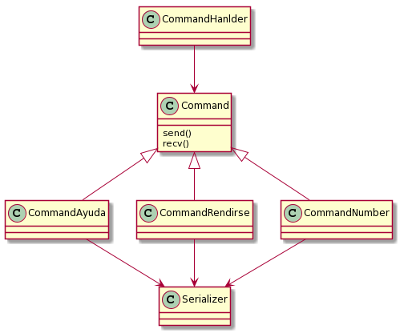
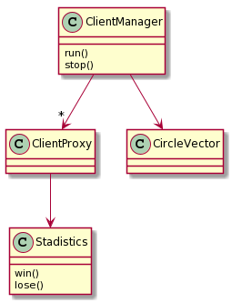
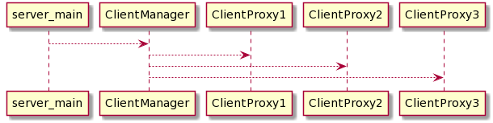

# TallerTP3
 
Nombre: Belinche Gianluca Ernesto

Padrón: 102674

[Link al repositorio](https://github.com/gianbelinche/TallerTP3.git) 

## Descripción del trabajo

En este trabajo se construyó una aplicación capaz de establecer un servidor y comunicarse con varios clientes de manera simultanea, gracias a la utilización de threads para cada uno de los clientes, esta aplicación consiste en un juego en el que el cliente debe intentar adivinar un numero de tres cifras no repetidas, y el servidor se encarga de comunicarle si el numero es correcto, y proporciona distinta información dependiendo de lo que mande el cliente.

Para realizar la aplicación, se utilizaron diversas clases, que estas divididas en 3 grupos, las exclusivas del cliente, las exclusivas del servidor y las comunes a ambos.

Se explicarán las diversas clases, teniendo en cuenta donde son usadas principalmente.

### Cliente

    - Command
    - CommandAyuda
    - CommandRendirse
    - CommandNumber
    - CommandHandler
    - Serializer

La clase Command, representa un comando que el cliente ingresa por entrada estandar, las clases CommandAyuda, CommandRendirse y CommandNumber derivan de esta.

En la clase Command esta definido el metodo recv, que dado un socket, recibe la respuesta del servidor del comando enviado, este metodo es comun a las 3 clases derivadas.

En esta clase hay un metodo send, que es virtual, por lo que cada derivada lo implementa de manera que envie al servidor lo que corresponda a cada comando.

La clase Serializer se encarga de transformar un comando en un mensaje que pueda ser enviado a través de un socket.

La clase CommandHandler, se encarga de interpretar el comando que fue anteriormente obtenido por la entrada estandar y decidir que derivado de Command instanciar.

### Server

    - ClientManager
    - ClientProxy
    - SecretNumberParser
    - Stadistics
    - CircleVector

La clase CircleVector es una simple implementación de un vector circular, que posee un metodo next que devuelve el próximo elemento.

La clase SecretNumberParser parsea el archivo de entrada y llena el CircleVector con los numeros correspondientes, en caso de que los numeros sean incorrectos esta clase se encarga de llevar a cabo una excepción que sera atrapada en el main.

La clase Stadistics lleva una cuenta de la cantidad de ganadores y perdedores, y es capaz de imprimir por salida estandar los mismos, como es utilizada por distintos threads, posee un mutex para su protección.

La clase ClientProxy, simula un cliente, y se encarga de recibir los comandos y enviar la respuesta adecuada a través del socket, cada cliente es un thread separado.

La clase ClientManager se inicializar los distintos clientes, y guardar una referencia a los mismos, para mas tarde poder terminar su ejecución cuando el servidor sea detenido.

## Diagramas

A continuación se mostrarán algunos diagramas para clarificar el trabajo

Diagrama de clases del cliete

Diagrama de clases del server

Diagrama que representa como se crean los distintos threads

